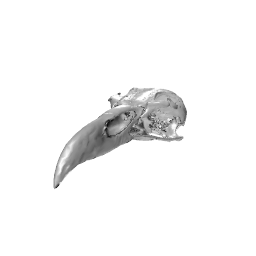

# About this work
This work was originally created by [Anna Krystalli](https://github.com/annakrystalli) from [RSE-Sheffield](https://github.com/RSE-Sheffield) under a [MIT licence](https://github.com/MalikaIhle/Collaborative-RStudio-GitHub/blob/master/LICENSE), and was subsequently adapted by [Malika Ihle](https://ox.ukrn.org/people/#MalikaIhle) from [Reproducible Research Oxford](https://ox.ukrn.org/).
 

The exercice is based on the [research](http://eprints.whiterose.ac.uk/99452/1/Bright%20et%20al.%202016_SelfArchive.pdf) of [Jen Bright](https://twitter.com/MorphobeakGeek) who also kindly provided the gifs used in the exercice.
You are free to use, copy, modify, distribute this work for your own projects.

***

# Collaborative coding with GitHub and RStudio

In this session, you will  
* **fork** a github repository (i.e. copy a collaborator's repository to your own GitHub account)    
* **clone** it locally (i.e. copy it to your computer while maintaining a connection to your remote (GitHub) version)    
* create a new file locally and **commit** it to your local repository (i.e. save the file locally in your version control system)  
* **push** your changes to your GitHub version (i.e. synchronise your local changes with your remote repository)  
* contribute a file to the original repository by making a **pull request** (i.e. request your collaborator, the owner of the original repository, to fetch your proposed changes and merge them into the original repository)   
* observe the outcome of all contributions merged by your collaborator   
* (optional) **pull the upstream repository into your fork** (i.e. update your fork to reflect all the changes that happened in your collaborator's original repository)  

 

In this example, the file you will contribute is required to simulate the evolutionary trajectory of an imaginary bird species’ body size. We will use RStudio and GitHub to collate all species files and plot them all up together at the end. We will also discover the skull and beak shapes associated with each species you contributed (after they 'evolved' through a simple brownian motion  model which assumes steps to progress comletely at random).

The material is self-paced and it is necessary that you work through the sections in order.

***

* **github:** fork 

- fork the repo into your own account
- copy repo url link local files to github repo 

 

* **rstudio:** clone locally

- create new project
- checkout from version control/git
- paste github repo link

 

* **rstudio:** create and edit your `.R` script

A template is provided in the repo, in folder `/params` named `params_tmpl.R`. Open the `params_tmpl.R` and **save as** to create a duplicate template. Name the template using the name of your species. 

 **!! PLEASE DO NOT EDIT THE `params_tmpl.R` FILE !!**

The parameters each participants need to supply are:

- **`sig2`:** A numeric value greater than 0 but smaller than 5

- **`species.name`:** a character string e.g. `"anas_krystallinus"`. Try to create a species name out of your name!

- **`color`:** e.g. `"red"`, `"#FFFFFF"` (tip: **pick a color using Rstudio's Color picker:**)

 

* **rstudio:** save and commit the changes

- Use the git tab, tick the box next to **your new script ONLY** and commit. 

- Supply a descriptive message of the commit.

 

* **rstudio:** push to github
- push your changes to github

 

* **github:** create pull request
 - create a pull request to merge your changes to the master repo

 
 
* **github:** check to see my response to your request
 - most likely it'll be a thumbs up! But I might also **request a correction** if I spot an error.  

 
* Once all parameters are collated, look out for the results on my screen
or former [results](http://rpubs.com/annakrystalli/278074) for asynchronous participants

* **rstudio** pull upstream repository into your fork
- open shell and type..

 

***
